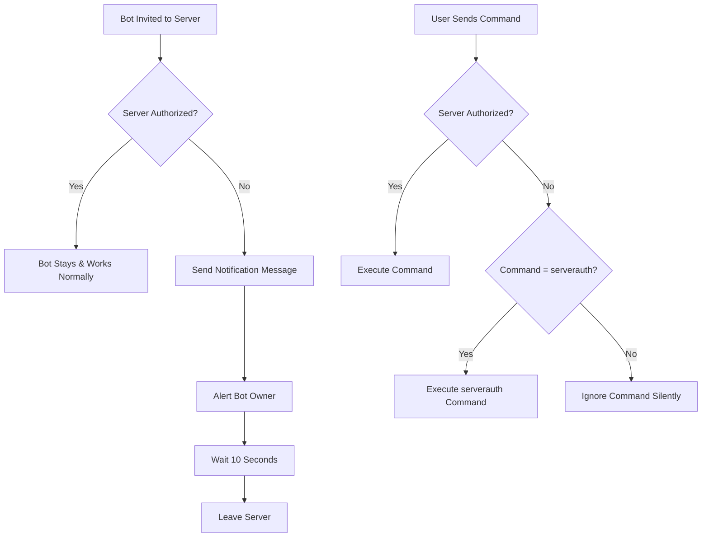

# 🛡️ Bot Security Implementation Summary

Your Discord bot now has comprehensive server security to prevent unauthorized usage!

## ✅ What's Been Added

### 1. **Automatic Server Protection**
- ✅ Bot automatically leaves unauthorized servers within 10 seconds
- ✅ Sends notification message explaining the restriction
- ✅ DMs bot owner about unauthorized invite attempts
- ✅ Logs all server join/leave events

### 2. **Command Restrictions**
- ✅ Only authorized servers can use bot commands
- ✅ Unauthorized servers can only use `!serverauth` command
- ✅ Silent command blocking (no error messages to unauthorized users)

### 3. **Server Management Commands**
- ✅ `!serverauth add <server_id>` - Authorize a server
- ✅ `!serverauth remove <server_id>` - Deauthorize a server  
- ✅ `!serverauth list` - View all authorized servers
- ✅ `!serverauth check` - Check current server status

### 4. **Enhanced Invite System**
- ✅ Updated invite generator with security warnings
- ✅ Provides both standard and restrictive invite options
- ✅ Clear setup instructions for server authorization

## 🚀 Quick Setup Guide

### Step 1: Find Your Server ID
1. Enable Developer Mode in Discord (User Settings → Advanced)
2. Right-click your server name → "Copy Server ID"

### Step 2: Authorize Your Server
```bash
!serverauth add YOUR_SERVER_ID_HERE
```

### Step 3: Optional - Add Owner Notifications
Add to your `.env` file:
```env
OWNER_USER_ID=your_discord_user_id_here
```

### Step 4: Test Security
- Use `!serverauth check` to verify authorization
- Try inviting bot to a test server (it should auto-leave)

## 🔐 Security Features

| Feature | Description | Status |
|---------|-------------|--------|
| **Auto-Leave** | Bot leaves unauthorized servers | ✅ Active |
| **Command Blocking** | Commands only work in authorized servers | ✅ Active |
| **Owner Alerts** | DM notifications for unauthorized attempts | ✅ Active |
| **Whitelist Management** | Dynamic server authorization | ✅ Active |
| **Logging** | Console logs for all server events | ✅ Active |
| **Staff Control** | Server auth commands require Staff role | ✅ Active |

## 📋 Files Modified/Added

### New Files:
- `src/utils/serverSecurity.js` - Core security system
- `src/commands/serverauth.js` - Server management commands
- `SERVER_SECURITY_SETUP.md` - Detailed setup guide

### Modified Files:
- `index.js` - Added security event handlers
- `generate-invite.js` - Enhanced with security warnings
- `.env.example` - Added OWNER_USER_ID option
- `src/commands/help.js` - Added serverauth command documentation

## ⚠️ Important Notes

1. **Initial Setup**: When first deployed, keep `ALLOWED_SERVERS` array empty to allow initial authorization
2. **Staff Access**: Only users with Staff role can manage server authorization
3. **Owner Notifications**: Set `OWNER_USER_ID` in `.env` to receive alerts
4. **Command Access**: `!serverauth` works even in unauthorized servers for initial setup

## 🎯 How It Works



## 🛠️ Management Commands

```bash
# Check current server status
!serverauth check

# Authorize current server (use actual server ID)
!serverauth add 1234567890123456789

# List all authorized servers
!serverauth list

# Remove server authorization
!serverauth remove 1234567890123456789
```

## 🚀 Next Steps

1. **Test the system** with `!serverauth check`
2. **Add your server ID** to the authorized list
3. **Set up owner notifications** (optional)
4. **Share restricted invite links** only with trusted users
5. **Monitor logs** for unauthorized access attempts

Your bot is now secure and will only work in servers you explicitly authorize! 🎉
